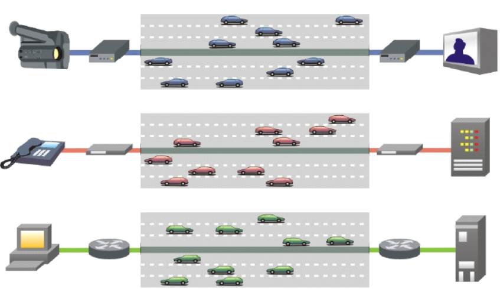
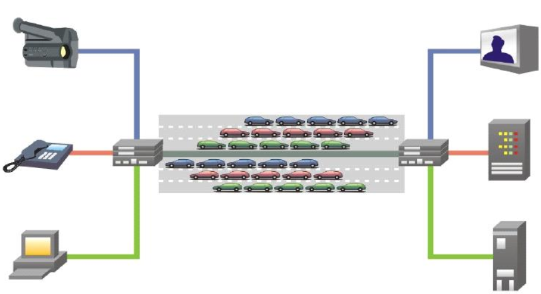
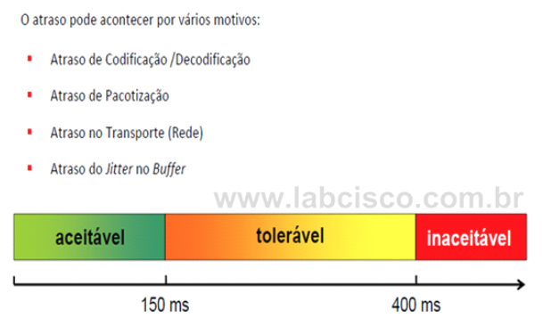

<!-- TODO
```
Understanding of DNS, TCP, Firewalls, Proxy Servers, Load Balancing, VPN and VPC and working knowledge of Linux.
```

### Network programming

- Let's Code a TCP/IP Stack

  - [Part 1: Ethernet & ARP](http://www.saminiir.com/lets-code-tcp-ip-stack-1-ethernet-arp/)
  - [Part 2: IPv4 & ICMPv4](http://www.saminiir.com/lets-code-tcp-ip-stack-2-ipv4-icmpv4/)
  - [Part 3: TCP Basics & Handshake](http://www.saminiir.com/lets-code-tcp-ip-stack-3-tcp-handshake/)
  - [Part 4: TCP Data Flow & Socket API](http://www.saminiir.com/lets-code-tcp-ip-stack-4-tcp-data-flow-socket-api/)
  - [Part 5: TCP Retransmission](http://www.saminiir.com/lets-code-tcp-ip-stack-5-tcp-retransmission/)
 -->


# (Working in Progress) Redes de Computadores  

## Requirements
| Requisite      | Version  |
|----------------|----------|
| Python         | 3.9.7    |
| Pip            | 21.2.4   |

Recomendo usar Python [venv](https://github.com/brunocampos01/becoming-a-expert-python#virtual-environment).

### Simulador SMTP :mailbox_closed::inbox_tray:
Neste problema replicamos o [protocolo SMTP](https://pt.wikipedia.org/wiki/Simple_Mail_Transfer_Protocol) utilizando [*sockets*](https://pt.wikipedia.org/wiki/Soquete_de_rede). Entenda o fluxo:<br/>
1. **[Client 1](smtp_socket/client_1.py) (Alice)** conecta no **[Server 1](smtp_socket/server_1.py)** (Servidor de correio de Alice) e envia *payload* (ou seja, sua mensagem).
2. **Server 1** age como "cliente" e se conecta no **Server 2** (Servidor de correio do Bob) e envia a mensagem de Alice.
3. **[Client 2](./smtp_socket/client_2.py) (Bob)** se conecta no **[Server 2](./smtp_socket/server_2.py)**, e então o mesmo envia a mensagem para Bob.
<br/>

Execute, respectivamente, nesta ordem: servidor 2, servidor 1, cliente 1 e cliente 2:
```bash
$ python server_2.py
$ python server_1.py
$ python client_1.py
$ python client_2.py
```

### Caminho Mínimo de Roteamento (Dijkstra Algoritm) :arrows_counterclockwise::soon:
O **[Caminho Mínimo de Roteamento](./caminho_minimo_roteamento/dijkstra.py)** é executado por cada nó de comutação na rede (isto é, nós preparados para encaminhar pacotes; na Internet, esses são chamados de roteadores). O conceito básico é que cada nó constrói um mapa da conectividade com a rede, na forma de um grafo, mostrando quais nós estão conectados a quais outros nós. Cada nó calcula, de forma independente, o melhor caminho lógico seguinte para cada destino possível na rede. Cada coleção de melhores caminhos formará a tabela de roteamento de cada nó. É o algoritmo de Dijkstra.


<span align="center">Exemplo de um caminho mínimo</span>


## Noções Básicas

### Máscara de sub-rede


#### Classes 
- 255.0.0.0 - Classe A 
- 255.255.0.0 -Classe B
- 255.255.255.0 - Classe C 

#### Máscara classe C 
- Os 3 primeiros octetos representam o ID da rede e o último o ID do computador. 
- `Total IPs = 256 - 2`
- Endereço IP 192.168.214.123 e máscara de sub-rede 255.255.255.0.  
O que posso fazer com esses dados? Analise-os verticalmente (um em cima do outro). 
 
 

Aqueles octetos do endereço IP que coincidirem, em posição, com os octetos 255 da máscara são os que representam a rede. Por sua vez, os octetos do endereço IP que coincidirem com os octetos 0 da máscara representam o micro (o indivíduo).

Ex) 
```
# ip
192.168.214.123 
192.168.214.30 
192.168.214.249 

# máscara
255.255.255.0 
```
Todos esses micros acima fazem parte da mesma rede. E lembre-se de que todos os micros da  mesma rede têm de ter a mesma máscara de sub-rede definida. 

---

### Cabo Twisted Pair 
- Consiste em um (ou mais) par de fios trançados entre si (cada par tem seus dois fios dispostos como uma trança), para evitar o ruído de cross-talk (linha cruzada). 
- Os cabos atualmente usados não possuem necessariamente apenas um par, há cabos usados em redes de computadores que usam até quatro pares de fios trançados. 
- Máximo de 100 m, apenas). Se maior precisa de repetidor. 
- Conectores: RJ 11 ou RJ 45. 
- UTP (Unshielded Twisted Pair – ou “Par trançado não blindado”) 
  - Mais barato 
  - Sem proteção a interferências 
  - É dividido em categorias 1 (linha telefônica), 5, 5e, 6 e 7 (gigabit ethernet) 
  
   
  <br/>
- STP (Shielded Twisted Pair – “Par trançado blindado”) 
  - Tem proteção a interferências (papel laminado) 
  - Menos maleável 

  

<br/>

#### Cabos Coaxiais 
 

- Tem melhor protecação os cabos STP. 
- O plugue é o BNC 
- Recebe o nome de coaxial pelo fato de que todos os seus elementos constituintes (núcleo interno, isolador, escudo, exterior e cobertura) estão dispostos em camadas concêntricas de condutores e isolantes que compartilham o mesmo eixo (axis) geométrico


#### Fibra ótica
 

- Pulsos luminosos (luz) em vez de sinais elétricos 
- Formado por núcleo de vidro, capa e casca (cladding) 
- Os cabos de fibra ótica contem varias fibras. 

---

## Socket
É formado por 2 informações: 
- protocolo  
- porta de comunicação 

 

<br/>

### Em Python
Python tem módulo de socket que prove uma interface que segue o padrão Berkeley sockets API.  

A comunicação básica entre cliente-servidor é assim:

 

<br/>

- [Aqui](https://realpython.com/python-sockets/) tem um excelente exemplo.

---

## Topologia de Redes
Uma topologia é um **layout**, um formato que determina como os computadores vão se ligar.

 

<br/>

#### Categorias 
Topologia física é a verdadeira aparência ou layout da rede, enquanto que a lógica descreve o fluxo dos dados através da rede.

Topologia Lógica é a maneira como os dados são transmitidos através da rede. Atualmente, quando se fala em “essa rede é anel” ou “essa rede é barra”, na verdade, refere-se à topologia lógica, porque, em sua grande maioria, as redes atualmente são estrela. 

As topologias mais comuns são: 
1. barramento 
2. anel 
3. estrela

---

## OSI Layers

### Camada física - 1 
**O que faz**: é a camada que trata a forma “bruta” dos sinais que transmitem dados. 
<br/>

#### Features
- Tem apenas componentes físicos.
- Os equipamentos físicos usados na transmissão dos sinais brutos (elétricos, luminosos ou eletromagnéticos) e os meios de transmissão. São integrantes desta camada os cabos (UTP, fibra óptica, coaxial), os repetidores, os conectores (RJ-45, BNC), as ondas de RF, as ondas infravermelhas e os hubs. 

 

<br/>

## Camada de Enlace - 2
**O que faz**: é responsável por “reunir” os sinais brutos (zeros e uns) e “entendê-los” como quadros, identificando suas origens e destinos (endereços MAC) e corrigindo possíveis erros ocorridos durante a transmissão pelos meios físicos. 

 

#### Características
- Componentes físicos e lógicos (protocolos). 
- **A camada do endereço MAC.**
- Como os dispositivos da camada 1 são apenas “fios” (ou seja, transmitem sinais brutos, sem nenhum grau de “inteligência”), torna-se responsabilidade dos dispositivos da camada 2 detectarem (e, se possível, corrigirem) as besteiras que a camada 1 venha a cometer. 
- É responsável tambem pelo envio da confirmação de recebimento acknowledgement) de quadro.
- Os equipamentos físicos que merecem pertencer à camada 2 são a placa de rede, a ponte, o ponto de acesso e o switch. 
- **Protocolos**: CSMA/CD, CSMA/CA 
 

## Camada de Rede - 3 
**O que faz**: ...

 

#### Features
- **A camada do endereço IP.**
- Os equipamentos (e protocolos) que criam e mantêm um ambiente inter-redes (inter-net), como o roteador, por exemplo, são pertencentes à camada 3. 


## Camada de Transporte - 4
**O que faz**: é responsável por oferecer meios de controle da transmissão, ou seja, garante que a mensagem de origem chegue no destino.

 

#### Features
- Tem apenas componentes lógicos.
- **É a camada que divide a mensagem em pacotes.**. 
- **Funcionamento**: atribue números de controle (como “pacote 1 de 15”, “pacote 2 de 15”, etc.) e, quando estes chegarem ao host de destino, a mesma camada naquele host concatena os pacotes enviados em ordem correta, resultando, assim, na montagem perfeita da mensagem original. 
- É a camada de transporte que também detecta e corrige possíveis erros em pacotes.
- **Protocolos**: TCP e UDP. 


## Camada de Rede - 7
**O que faz**: é responsável por organizar os protocolos de aplicação.

#### Features
os protocolos e serviços (tarefas) a que os usuários têm acesso são componentes da camada de aplicação.

## Resumo 
- **Física (1)**: define as características para ativar, manter e desativar conexões físicas para a transmissão de bits.  
- **Enlace de Dados (2)**: detecta e corrige erros na camada de meios físicos, fornece à camada de rede a capacidade de pedir estabelecimento de circuitos de dados na camada física (isto é, a capacidade de controlar o chaveamento de circuitos).  
- **Rede (3)**: agrupa protocolos de operação da rede, tais como algoritmos de roteamento e de controle de congestionamento. Cabe a ela levar os pacotes da origem ao destino, optando pelo caminho apropriado. A camada de rede deve conhecer a topologia da sub-rede, proporcionado uma rota que evite congestionamentos, podendo inclusive exigir muitos saltos em nós intermediários. Quando a origem e o destino estão em redes diferentes, cabe a camada de redes resolver os problemas de compatibilidade como: diferenças de endereçamento, tamanho do pacote e protocolos diferentes. 
- **Transporte (4)**: controla o transporte de dados.
- **Sessão (5)**: organiza e sincroniza o diálogo.
- **Apresentação (6)**: codificar e decodificar.
- **Aplicação (7)**: Telnet, SSH, FTP, SMTP, SNMP e HTTP. 

---

## Protocolos

## Protocolos da Camada de: Rede
Protocolos mais importantes: 
- IP 
- ICMP - detecta erros 
- ARP 


#### Protocolo IP 
Tem 2 funções: 
- Endereçar os endereços os hosts de origem 
- Rotear as mensagens até o destino. 

 

O IP manipula pacotes (datagramas). Cada pacote IP contém, em seu cabeçalho: 
- Endereço IP de Destino  
- Endereço IP de Origem 
- TTL (Time-to-Live – Tempo de Vida): é um número de segundos (ou saltos – hops) que o pacote deve “viver” para atravessar a Internet. 
- Protocolo - identifica o conteúdo do envelope. 
- Checksum do Cabeçalho - um resumo "hash" para detecção de erros 
- Comprimento (Length): esse campo identifica o tamanho que o pacote tem, em by tes. Um pacote IP pode ter 576 by tes (no mínimo) e 65.536 by tes (64 Kilobytes) no máximo. 

OBS: o protocolo IP é considerado não-orientado a conexão.Isso significa que o protocolo IP não se preocupa em estabelecer conexões prévias entre origem e destino para poder transmitir. Nem se preocupa se o pacote chegou ou não. Nem exige qualquer tipo de confirmação do destinatário. 


#### Protocolo ICMP  (Internet Control Messaging Protocol – Protocolo de Mensagens de Controle de Inter-Redes) 
- Faz algo que o IP não faz: a detecção de erros nos pacotes. 
- Funciona mais ou menos assim: quando um roteador recebe um pacote IP contendo dados, ele analisa aquele pacote, a fim de descobrir se há algum problema. Se não houver, ótimo, o pacote é encaminhado à próxima rede; mas se houver algum problema naquele pacote, o roteador em questão constrói, por meio do protocolo ICMP, uma mensagem de erro (ou mensagem de controle) e a envia em um pacote IP ao emissor daquele pacote defeituoso, pedindo que se tomem as providências necessárias (como o reenvio). 
- Mensagem ICMP é encapsulada em (colocada dentro de) um pacote IP normal. 


#### Protocolo ARP (Address Resolution Protocol – Protocolo de Resolução de Endereços)

É usado para associar um endereço IP a um endereço de hardware. 

 


## Protocolos da Camada de: Transporte
Apenas dois protocolos: 
- TCP 
- UDP 

### Protocolo TCP (Transmission Control Protocol – Protocolo de Controle de Transmissão) 
- orientado a conexão, ou seja, quer dizer que o protocolo TCP faz com que o emissor só comece a transmitir seus dados se tiver certeza de que o receptor está pronto para ouvi-los. 

#### Características
- É confiável: garante a entrega de todos os dados no destino sem defeito ou perda. 
- Garante a sequência dos segmentos: os segmentos que saem do emissor são numerados e 
reunidos na mesma ordem no micro de destino. 
- Reconhecimento: o receptor envia um segmento de confirmação (reconhecimento) para 
cada segmento de dados que receber, informando ao emissor que ele já poderá transmitir o próximo segmento da sequência. 
- Retransmissão: se um segmento se perder (por causa de problemas de transmissão nas demais camadas), o TCP do receptor solicitará ao TCP do emissor o reenvio do segmento faltoso. 
- Detecção de duplicidade: o TCP reconhece se um segmento chegou em duplicidade no receptor e automaticamente descarta o segmento duplicado. 
- Controle de fluxo: o emissor não vai enviar mais segmentos do que a quantidade que o receptor for capaz de processar (mesmo porque o emissor só transmitirá quando o receptor informar que ele pode fazê-lo). 
- Controle de congestionamento: o TCP ajusta-se automaticamente às quedas de desempenho da rede provocadas por congestionamento (nos roteadores e servidores, por exemplo). 
- Estabelece sessões: o TCP trabalha por meio do estabelecimento de sessões de comunicação, em que várias transmissões são feitas em bloco e consideradas parte de uma sessão só. 
- Troca informações de estado (status): os dois hosts ligados em TCP trocam entre si constantemente informações de apresentam o status da conexão entre eles. 
- Baixa velocidade: devido à grande quantidade de informações, recursos e itens que garantem a integridade das transmissões via TCP, é fácil deduzir que o protocolo TCP não é tão rápido quanto seu “irmão inconsequente”. 
- Three handshake


<br/>

### Protocolo UDP (User Datagram Protocol – Protocolo de Datagrama de Usuário) 
- Fornece uma entrega rápida (streming de videos e musicas) 
- Não confiável. Ele não fornece o controle de fluxo necessário, nem tampouco exige uma confirmação do receptor, o que pode fazer com que a perda de um pacote. 

| UDP                                                                                                          | TCP                                                                                                    |
|--------------------------------------------------------------------------------------------------------------|--------------------------------------------------------------------------------------------------------|
| Serviço sem conexão;  nenhuma sessão é estabelecida entre os hosts.                                          | Serviço orientado por conexão;  Uma sessão é estabelecida entre os hosts.                              |
| UDP não garante nem confirma a  entrega dos dados, nem organiza em  sequência os mesmos.                     | TCP garante a entrega através do uso de confirmações e entrega sequenciada dos dados.                  |
| Os programas que usam UDP são responsáveis por oferecer a confiabilidade necessária ao transporte de dados.  | Os programas que usam TCP têm garantia de  transporte confiável de dados dada pelo próprio protocolo.  |
| UDP é rápido                                                                                                 | TCP é mais lento                                                                                       |


---

## Vlan

É uma rede local virtual, sendo um novo nível de rede. 

 

Características: 
- É uma forma de agrupar usuários por grupo de interesse, por exemplo, por seções ou departamentos. 
- Uma VLAN só pode ser feita por intermédio de um dispositivo da camada 3 (router). OBS: switches L3 também possuem a habilidade de rotear pacotes IP. 
- Cada VLAN deve estar em um IP diferente; 
- Independência da topologia física: podem-se criar diferentes topologia virtuais, sem alterar a topologia física; 

 

<br/>

### Tipos de VLANs 
- **VLAN estática** é mais segura e mais fácil de gerenciar. 
- **VLAN dinâmica** determina automaticamente uma VLAN para um dispositivo.
  - similar ao DHCP com os IPs 
  - como acontece ? 
    - o SW que gerencia a VLAN dinâmica procura o endereço MAC e então configura a porta do switch (mapeamento MAC x VLAN). Se o usuário muda de local é refeito o mapeamento e associado a mesma VLAN. 


### Protocolos das VLANs 
- VTP 
- ISL (somente switches da Cisco) 
- IEEE 802.1q 

#### Protocolo VTP (virtual trunck protocol) 
- É um protocolo para gerenciar as redes VLANs podendo: Adicionar, deletar ou renomear VLANs sendo isso propagado para todos os switches do domínio. 
- Permite o plug-and-play de VLANs. 
- Por default todos os switches cisco operam como servidores VTP; 

**NOTA**: As 3 funções básicas de um switch na camada 2 são: 
- Aprender os endereços 
- Rotear pacotes 
- Impedir loops 

<br/>

---

# Camadas OSI-ISO  

 

---

## Etherchannel

O que é?

 

é a agregação de diversas interfaces Ethernet (portas físicas) para a utilização de uma única porta lógica com o intuito de prover redundância e aumento de banda é uma atividade muito comum em redes de médio e grande porte.

#### Características 
- 2 ou + portas físicas conectadas se comportando como somente 1 
- Redundância (segurança) 
- Aumento de banda (throughput) 

**Nota**: use velocidades de portas idênticas como: interfaces 1Gb com interfaces 1G e interfaces 10Gb com interfaces 10Gb e assim por diante…

---


## Quality of Service

É uma forma de gerenciar o tráfego de comunicação.<br/>
Significa identificar e tratar de forma diferenciada tipos de informação que trafegam em uma rede.


Uma “estrada” para cada tipo de tráfego.



Redes diferentes para Voz, Dados e Vídeo.
Mas na prática as redes convergem:



QoS para Voz


QoS para Video-ConferenciaPágina 79 de Papirus


QoS para Dados


Funções do QoS


1. Classifica os pacotes
2. Marca eles
3. Condiciona para a via correta
4. Transmite

---
---

# Métricas de redes


Delay -
Latência = Tempo chegada -tempo partida
LAG (latency at game)


Métricas para desempenho de redes
latência (atraso)
jitter (variação da latência no tempo)

A latência mostra o desempenho real da rede naquele exato momento, enquanto que o jitter mostra seu comportamento ao longo do tempo, ou seja, define o grau de estabilidade da rede


Valores aceitáveis de latência:





---
---

# Ping

- Protocolo ICMP(internet control message protocol)
- É um protocolo que fornece um relatório de erros à sua fonte de origem.
- As mensagens ICMP geralmente são enviadas automaticamente em uma das seguintes situações:
    - Um pacote IP não consegue chegar ao seu destino (i.e. Tempo de vida do pacote expirado)
    - O Gatewaynão consegue retransmitir os pacotes na frequência adequada (i.e. Gateway congestionado)
    - O Roteador indica uma rota melhor para a máquina a enviar pacotes.

- Ferramentas comumente usadas em Windows baseadas nesse protocolo são: Pinge Traceroute.


## Frames ICMP

- Echo Request / Reply
- Mensagens para funções de teste e controle da rede, caso a máquina esteja ligada ira responder com um reply e se estiver inalcançável request
- Usadas pelo comando PING


---
---
# Gateway

O nome geral para uma máquina que faz uma conexão entre duas ou maisredes e oferece a conversão necessária, tanto em termos dehardware quanto de software, é um gateway

---
---

# DHCP


## Lease
- É o tempo de concessão de um IP para uma máquina.
- Como se fosse a carteirinha da Unimed.
- Quem fornece é o servidor DHCP.


---

##### Referências

- [1] https://realpython.com/
- [2] wikipedia

---

<p  align="left">
	<br/>
	<a href="mailto:brunocampos01@gmail.com" target="_blank">
	</a>
	<a href="https://stackoverflow.com/users/8329698/bruno-campos" target="_blank">
	</a>
	<a href="https://www.linkedin.com/in/brunocampos01" target="_blank">
	</a>
	<a href="https://github.com/brunocampos01" target="_blank"></a>
	<a href="https://medium.com/@brunocampos01" target="_blank">
	</a>
    <a rel="license" href="http://creativecommons.org/licenses/by-sa/4.0/">
    </a>
    <br/>
</p>
