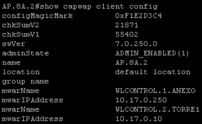

# Access Point

## Check Configuration
```
Enable
Show capwap ip configuration
```

## Show Controller
```
Show capwap ip client configuration
```



## Change IP
```
lwapp ap ip address <IP address> <subnet mask>
```

## Change gateway
```
lwapp ap ip default-gateway <IP-address>
```

## Change Controller
```
lwapp ap controller ip address <IP-address>
```

## Change Name
```
lwapp ap hostname <name>
```