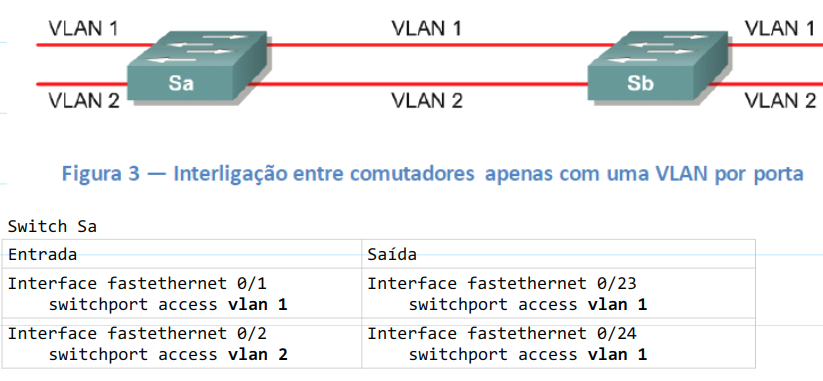

# Basic Comands
### Check Configuration
```
show running-configuration
```

### Configuration Mode
- Qualquer alteração no switch deve estar no mode `config`
```
config terminal
```


### Start Swicth
```
Would you like to enter the initial configuration dialog? [yes/no]:n

Continue with configuration dialog? [yes/no]: n
```


### Show interfaces each Port
```
show ip interface brief
```


### Show Status
```
show interface status
```


### Access Port
```
interface fastethernet 0/1
```

ou um range de portas

```
interface range fastethernet0/1 -24
```


### Save Changes
```
copy running-configuration start
```

ou

```
wr
```


## Configuração de VLAN e IP, gateway
```
enable
config terminal

vlan 000
name brunocampos_vlan
int vlan 000
ip address 00.000.000.199 255.255.255.0
no shut
exit
ip default-gateway 00.00.00.1
int vlan 000
no shut
exit
exit
```

###  Ping the Gateway to Test
```
ping 10.0_.__.__
```


## Update Swicth

- Colocar o servidor tftp no ar para fazer o donwload do arquivo

```
enable
config terminal

archive download-sw /overwrite /reload tftp://00.00.00.05/c2960-lanbasek9-tar.150-2.SE8.tar

wr
reload
```


## Authentication 
```
enable
config terminal

aaa
authentication-scheme default
quit

authorization-scheme default
quit

accounting-scheme default
quit

local-user USER password cipher PASSWORD
local-user USER privilege level 15
local-user USER service-type telnet http
local-user tjsc01 password irreversible-cipher PASSWORD-
local-user tjsc01 privilege level 15
local-user tjsc01service-type telnet http 
quit
```

## Set Name
```
enable
config terminal

Hostname NAME
```


## IP
```
enable
config terminal

ip domain-name WWW.HOSTNAME.COM
ip name-server 00.00.00.01
ip name-server 00.00.00.02
```


## SSH
```
enable
config terminal

crypto key generate rsa
ip ssh version 2
ip ssh authentication-retries 3
ip ssh time-out 120
line vty 0 15
transport input ssh
exit
```


## SNMP
```
enable
config terminal

snmp-server community NAME_SUBNET
snmp-server location NUMBER
snmp-server contact EMAIL
snmp-server chassis-id NUMBER
```


## SNTP
```
enable
config terminal

ntp server 10.00.1.2
clock timezone GMT -3
```


## DNS
```
dns server 00.00.00.81
dns server 00.00.00.82
dns domain mydomain.br
```

## Mode trunk  GIGA
```
enable
config terminal

int range gigabitEthernet 0/1-2
switchport mode trunk
no shut
Exit
```


## Create VLAN
```
enable
config terminal

vlan 300
Name_________________
exit
int range fastEthernet 0/1 - 24
switchport mode access
switchport access vlan 300
switchport port-security maximum 30
switchport port-security
spanning-tree portfast
exit
exit
```


## Create VLAN

- Será preciso saber:
    - O switch
    - As portas
    - O backbone (Layer 3)
    - Qual a posição dele na cascata

- Acesse o backbonee crie lá a VLAN (serve para q ele permita o tráfego).
- Acesse os outros switch da cascata acima dele e também crie a vla

```
enable
config terminal

int vlan 1
ip address 00.00.1.48 255.255.255.128
no shut
exit
ip default-gateway 00.00.00.1
exit
```


## Remove VLAN
```
enable
config terminal

no vlan 300
```

ou

```
enable
config terminal

vlan 000
shut
```


## VLAN trunking Port
Config type :
- Acess
- Trunk

Numa porta acesso trafegam somente pacotes referentes a VLAN da porta.Então, a ligação entre 2 switches será da seguinte forma:



<br/>

Truk port trafegam pacotes de todas as VLANs dos switches.
<br/>
A ligação entre 2 switches em modo trunk:


## Check Configuration
- Testar via SSH pelo ip 00.00.xx.xx e ver se a senha está funcionando. caso esteja
```
wr
```


## Check Neighbors Switchs
```
show cdp neighbors
```

## Find 

#### MAC
- Por ser layer 2 o MAC pode ser obtido pelo switch.
- Saber todos os MAC que estão no switch
```
show mac address-table | i Fa
```


#### IP
- Para isso será necessário estar no layer 3.
- Então acessar o backbone do local.
- No comando será necessário informar o MAC do IP que queremos saber:
```
show arp | i ___________________
```


### Set Multiples MAC by Port
```
interface FastEthernet0/__
switchport port-security maximum 5
```


---

# Activate interface (open port)
- Se STATUS=DISABLE esta **bloqueado**
- Se STATUS=NOTCONNECT esta **desbloqueada e sem nada conectado**

```
show ip interface br
```


- Activate Interface

```
enable
config terminal

interface range fastethernet0 -x
no shutdown
```


